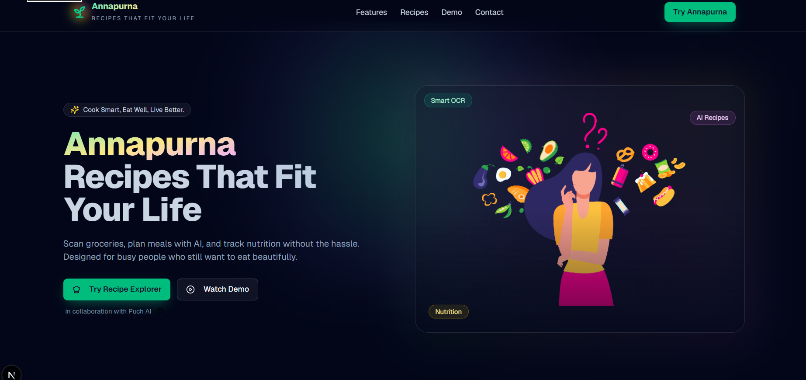
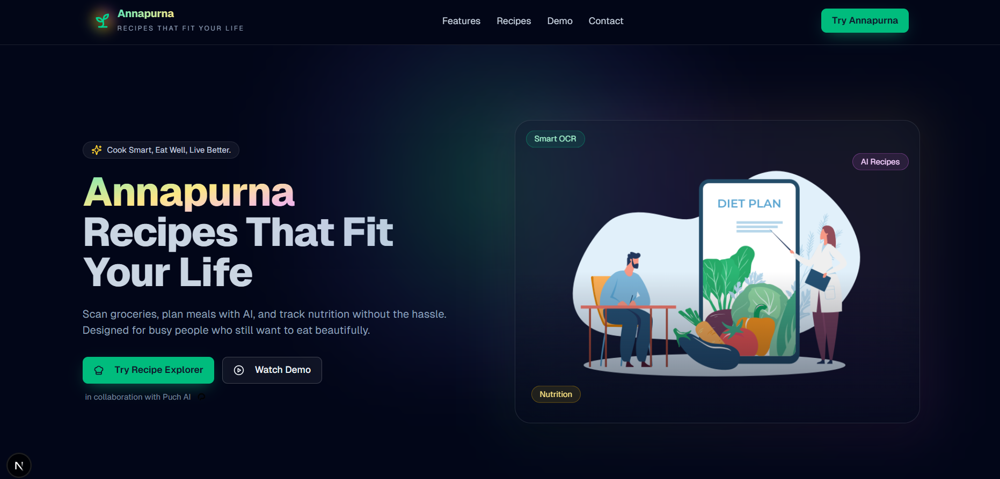

## Annapurna

Cook smart. Eat well. Live better.


### What is this?

Annapurna is a modern recipe and meal companion built with performance and design in mind. Scan groceries, get AI‑curated recipes, and track nutrition — all in a delightful, minimal UI.

### Highlights

- **Smart Inventory Scan**: OCR your bills/fridge photos into a live pantry.
- **AI‑Powered Recipes**: Personalized ideas based on time, diet, and what you have.
- **Nutrition Insights**: Quick calorie/macros overview as you cook and log.
- **WhatsApp Fast Lane**: Interact via chat for ultra‑fast actions.
- **Smooth UX**: Motion, ambient glows, and Lottie visuals.

### Glimpse

<p align="center">
  
  
</p>

### Tech Stack

- **Next.js 15** + **React 19**
- **Tailwind CSS 4** for styling
- **Framer Motion** for animations
- **Radix UI** + **Lucide** icons
- **Lottie** for rich animations

### Quick Start

```bash
pnpm install
pnpm dev
# open http://localhost:3000
```

Or with npm:

```bash
npm install
npm run dev
```

### Scripts

- **dev**: start the local dev server
- **build**: production build
- **start**: run the production server
- **lint**: lint the codebase

### Structure

```text
app/                # App routes & layout
components/         # UI building blocks
lib/                # Data & utilities
public/             # Static assets (images, icons, lotties)
```

### Notes

- Favicon and tab title use the current header branding.
- Images live under `public/`; update there to swap visuals quickly.
